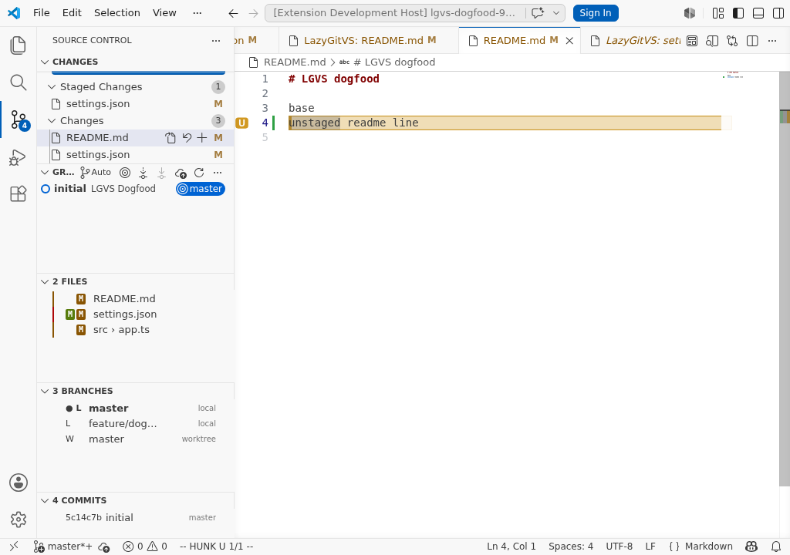

# LazyGitVS

<p align="center">
  
</p>

<p align="center">
  <strong>lazygit muscle memory, inside the VS Code Source Control sidebar.</strong>
</p>

<p align="center">
  <a href="https://github.com/djangonavarro220/LazyGitVS/actions/workflows/ci.yml"></a>
  <a href="https://marketplace.visualstudio.com/items?itemName=lazygitvs.lazygitvs"></a>
  <a href="https://github.com/djangonavarro220/LazyGitVS/releases"></a>
  <a href="LICENSE.txt"></a>
</p>

LazyGitVS is a keyboard-first Git workflow for VS Code, inspired by [lazygit](https://github.com/jesseduffield/lazygit).

It is **not** a terminal wrapper. It uses VS Code-native surfaces where they are better: SCM sidebar views, QuickPick menus, input boxes, native diffs, and real editors for hunk/line work.

<p align="center">
  
</p>

Current preview: **0.1.96**

## Why this exists

VS Code's built-in Git UI is solid, but it is mouse-heavy and fragmented when you live on the keyboard. Lazygit is fast, coherent, and memorable — but it lives outside the editor.

LazyGitVS brings the good part into VS Code:

- one Git cockpit in the SCM sidebar
- lazygit-style panel jumps and command keys
- native VS Code diffs/editors instead of a fake terminal pane
- hunk and line staging without leaving the file you are editing

Still preview software. Useful, dogfooded, improving fast. Not pretending to be a mature Git client yet — that would be cheap cosplay.

## Install

Marketplace:

[Install LazyGitVS](https://marketplace.visualstudio.com/items?itemName=lazygitvs.lazygitvs)

Or from VS Code:

```text
Extensions: Install Extensions
Search: LazyGitVS
```

From a downloaded VSIX:

```bash
code --install-extension lazygitvs-0.1.91.vsix --force
```

## Requirements

- VS Code `^1.90.0`
- Git on `PATH`
- A Git repository opened as the current workspace

## Open it

```text
Ctrl+Alt+G
```

That focuses LazyGitVS in the Source Control sidebar.

## Core workflow

### Panels

LazyGitVS keeps lazygit's numbered navigation, adapted to VS Code's SCM sidebar:

```text
1  Status
2  Files
3  Branches
4  Commits
5  Stash
6  Conflicts
7  Tags
8  Remotes
```

### Everyday keys

```text
1..8        Jump panels
j/k         Move selection
↑/↓         Move selection
Space       Toggle/action selected item
Enter       Main action
?           Contextual command menu
/           Search/filter
r           Refresh
Esc         Clear filter / back
q           Close sidebar
```

### Files panel

```text
Space       Stage/unstage file
Enter       Open the real file and enter editor HUNK mode
v           Start/clear range selection
Shift+↑/↓   Extend range selection
F           File status filter
c           Commit
w           Commit without hook
A           Amend last commit
C           Commit with body
P           Push menu
p           Pull/fetch menu
s           Stash all
S           Stash options
d           Discard menu
D           Reset/nuke menu
```

Files use explicit staged/worktree badges instead of raw porcelain soup:

- `S` lane: staged/index state
- `U` lane: unstaged/worktree state
- green: staged
- red: unstaged
- yellow: untracked
- blue/error: mixed/conflict states

## Editor HUNK and LINE mode

`Enter` on a changed file opens the actual file editor and enters LazyGitVS HUNK mode. No duplicate fake editor, no terminal textarea, no weird side quest.

```text
j/k, ↑/↓    Move hunk/line selection, wrapping at edges
Space       Stage/unstage selected hunk or line
a           Toggle HUNK/LINE mode
Tab         Toggle unstaged/staged side
d           Discard/unstage selected hunk or line
?           Contextual HUNK/LINE command menu
e           Switch to normal EDIT mode
Esc         Exit HUNK mode back to Files
q           Close LGVS/sidebar
```

EDIT mode is normal VS Code editing:

```text
normal typing   Edit the file normally
Ctrl+Enter      Return to LGVS HUNK mode on the same file
```

Hunk/line selection is shown in the editor with highlights and gutter markers. Staged/unstaged visual state is kept separate so you do not get the classic “everything is selected, good luck” diff mush.

## What it can do today

- SCM sidebar Git cockpit with lazygit-style panels
- real file previews and VS Code diff/editor integration
- file stage/unstage, stage all, unstage all
- range selection in Files
- hunk and line stage/unstage
- branch, commit, stash, conflict, tag, and remote panels
- push, pull/fetch, stash, discard, reset, branch, commit, and conflict QuickPick menus
- lazygit config/keybinding reading where implemented
- UI dogfood tests in GitHub Actions
- VSIX packaging as CI artifacts and GitHub Releases

## Dangerous actions

LazyGitVS exposes destructive Git operations because hiding them would make it a toy.

These actions require confirmation:

- force push with lease
- discard file / hunk / line
- reset hard
- reset to commit
- drop stash
- `💣 Nuke working tree`

`Nuke working tree` runs:

```bash
git reset --hard HEAD
git clean -fd
```

That discards staged, unstaged, and untracked changes. LazyGitVS cannot undo it. Git is sharp; don't lick the blade.

## Known limitations

- Single-root workspace assumption for now.
- Git operations use the Git CLI directly.
- Lazygit config/keybinding parity is partial and incremental.
- HUNK/LINE mode is VS Code-adapted; it is not a literal terminal UI.
- Conflict resolution uses VS Code-native files/merge editor; no custom conflict resolver panel yet.
- Native SCM sidebar scrolling is limited by VS Code public APIs. Numeric jumps update LGVS selection/focus, but in a cramped sidebar VS Code may not visibly scroll collapsed deep panels like `7 Tags` / `8 Remotes` into view. See [`docs/known-bugs.md`](docs/known-bugs.md).

## Development

```bash
npm ci
npm run compile
npm test
npm run dogfood:ui
npm run package:dist
```

Useful scripts:

```text
npm test              Compile + unit/integration tests
npm run dogfood:ui    Headless VS Code UI dogfood smoke test
npm run package       Local dogfood VSIX build
npm run package:dist  Portable repo-local VSIX in dist/
```

Default local dogfood builds write to:

```text
../releases/LazyGitVS/lazygitvs-${version}.vsix
```

Portable CI/release builds write to:

```text
dist/lazygitvs-${version}.vsix
```

## CI and releases

GitHub Actions runs on pushes and pull requests:

- `npm ci`
- `npm test`
- `npm run package:dist`
- `npm run dogfood:ui`
- upload VSIX artifact

Version tags publish release artifacts:

```bash
git tag v0.1.91
git push origin v0.1.91
```

The tag workflow creates a GitHub Release with the VSIX. If `VSCE_PAT` is configured as a repository secret, it also publishes the same VSIX to the Visual Studio Marketplace.

## License

MIT
