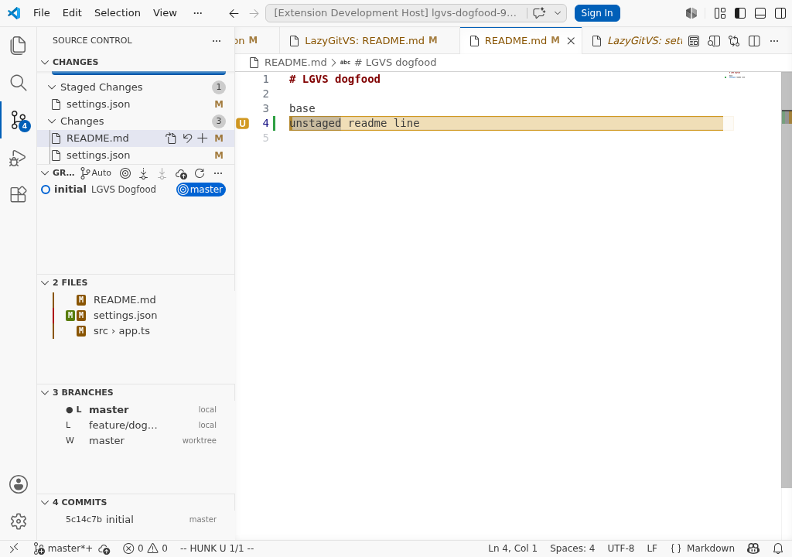

# LazyGitVS

<p align="center">
  
</p>

<p align="center">
  <strong>lazygit muscle memory, inside the VS Code Source Control sidebar.</strong>
</p>

<p align="center">
  <a href="https://github.com/djangonavarro220/LazyGitVS/actions/workflows/ci.yml"></a>
  <a href="https://marketplace.visualstudio.com/items?itemName=lazygitvs.lazygitvs"></a>
  <a href="https://github.com/djangonavarro220/LazyGitVS/releases"></a>
  <a href="LICENSE"></a>
</p>

LazyGitVS is a keyboard-first Git workflow for VS Code, inspired by [lazygit](https://github.com/jesseduffield/lazygit).

It is **not** a terminal wrapper. It uses VS Code-native surfaces where they are better: SCM sidebar views, QuickPick menus, input boxes, native diffs, and real editors for hunk/line work.

<p align="center">
  
</p>

Current preview: **0.1.103**

## Why this exists

VS Code's built-in Git UI is solid, but it is mouse-heavy and fragmented when you live on the keyboard. Lazygit is fast, coherent, and memorable — but it lives outside the editor.

LazyGitVS brings the good part into VS Code:

- one Git cockpit in the SCM sidebar
- lazygit-style panel jumps and command keys
- native VS Code diffs/editors instead of a fake terminal pane
- hunk and line staging without leaving the file you are editing

Still preview software. Useful, dogfooded, improving fast. Not pretending to be a mature Git client yet — that would be cheap cosplay.

## Install

Marketplace:

[Install LazyGitVS](https://marketplace.visualstudio.com/items?itemName=lazygitvs.lazygitvs)

Or from VS Code:

```text
Extensions: Install Extensions
Search: LazyGitVS
```

From a downloaded VSIX:

```bash
code --install-extension lazygitvs-<version>.vsix --force
```

## Requirements

- VS Code `^1.90.0`
- Git on `PATH`
- A Git repository opened as the current workspace

## Open it

```text
Ctrl+Alt+G
```

That focuses LazyGitVS in the Source Control sidebar.

## Core workflow

### Panels

LazyGitVS keeps lazygit's numbered navigation, adapted to VS Code's SCM sidebar:

```text
1  Status
2  Files
3  Branches
4  Commits
5  Stash
6  Conflicts
7  Tags
8  Remotes
```

### Everyday keys

```text
1..8        Jump panels
j/k         Move selection
↑/↓         Move selection
Space       Toggle/action selected item
Enter       Main action
?           Contextual command menu
/           Search/filter
r           Refresh
z / Z       Undo / redo commit and branch actions via reflog
Esc         Clear filter / back
q           Close sidebar
```

### Files panel

```text
Space       Stage/unstage file
Enter       Open the real file and enter editor HUNK mode
v           Start/clear range selection
Shift+↑/↓   Extend range selection
F           File status filter
c           Commit
w           Commit without hook
A           Amend last commit
C           Commit with body
P           Push menu
p           Pull/fetch menu
s           Stash all
S           Stash options
d           Discard menu
g           Reset to @{upstream} (mixed / soft / hard)
D           Reset/nuke menu
```

`g` follows lazygit's `keybinding.commits.viewResetOptions` setting (default `g`) in Files. It opens `Reset to @{upstream}` with mixed, soft, and hard reset choices; every history reset asks for confirmation, and hard reset explicitly warns that index and working-tree changes are discarded.

### Commits panel

```text
b           View bisect options for the selected commit
v           Start/clear a sticky visual commit range
Shift+↑/↓   Create/extend a non-sticky visual commit range
d           Drop the selected ordinary commit/range after confirmation
s           Squash the selected ordinary commit/range into the commit below
S           Open Apply fixup commits → Above the selected commit (bounded autosquash)
f           Open the Fixup menu for the selected ordinary commit/range
r           Reword the selected ordinary commit summary
e           Start Edit rebase for the selected ordinary commit/range
C           Copy/toggle the selected commit range for cherry-pick
V           Confirm and paste copied commits oldest-first
Ctrl+R      Clear copied commits without changing Git
```

The key follows lazygit's `keybinding.commits.viewBisectOptions` setting (default `b`). The native `Bisect` picker offers only actions valid for the current Git bisect state and asks before resetting a bisect. Drop follows lazygit's configured `keybinding.universal.remove` (default `d`), Squash-down follows `keybinding.commits.squashDown` (default `s`), Apply fixup commits follows `keybinding.commits.squashAboveCommits` (default `S`), Fixup follows `keybinding.commits.markCommitAsFixup` (default `f`), Reword follows `keybinding.commits.renameCommit` (default `r`), and Edit follows `keybinding.universal.edit` (default `e`), only in the top-level Commits list; Files and HUNK/LINE keep their own `d` discard paths and Files keeps its existing `e` edit path.

LazyGitVS has **partial Commit-files checkout parity**: after `Enter` opens one inspected commit with no visual range, configured `keybinding.commitFiles.checkoutCommitFile` (default `c`) checks out the selected file or directory path with `git checkout <commit> -- <path>` through VS Code's native extension process—never a terminal. It verifies the captured commit and selected relative literal path, checks the selected path twice with NUL-delimited porcelain status, and refuses tracked staged, unstaged, conflicted, deleted, or renamed local changes with a `local modifications` error. Unrelated changes remain untouched. Because Git can silently overwrite an untracked path here, LGVS detects source-path collisions first and refuses them. There is no confirmation, and success refreshes Files while retaining Commit-files selection and preview.

LazyGitVS also has **partial Commit-files discard parity**: inside that same one-commit Commit-files drilldown, configured `keybinding.universal.remove` (default `d`) asks **Discard file changes** with lazygit's exact rebase warning. After a second full-tree/branch/commit revalidation it uses a private 0700 interactive-rebase sequence editor to change exactly the captured commit's generated `pick` to `edit`; each selected ordinary file is restored from `HEAD^`, or removed and staged when it was new (and every selected root path is removed). It then amends with `--allow-empty --allow-empty-message` and continues with `GIT_EDITOR=true`. A selected directory expands only to captured Commit-files under its literal `dir/` prefix. On success the stale drilldown exits safely to top-level Commits at the prior clamped index; if later replay conflicts, Git's rebase remains active for Status recovery and LGVS never auto-aborts.

LazyGitVS has **bounded Commit-files clipboard parity**: in that same single inspected commit, configured `keybinding.files.copyFileInfoToClipboard` (default `y`) opens the upstream **Copy to clipboard** menu with `n` file name, `p` relative path, `P` absolute path, `s` selected diff, `a` all-files diff, and `c` file content. Each callback captures the repository, commit, selected tree row, and Git diff settings when the menu opens; it never falls back to the top-level selected commit or `HEAD`. The diff actions read the parent-to-commit delta with plain `git diff`, no external diff, literal pathspecs, configured context/rename threshold, and the empty tree for an initial commit; content uses `git show <commit>:<path>`. These operations are read-only. A directory supports `n/p/P/s/a`; `c` is omitted because VS Code QuickPick cannot represent lazygit's disabled directory-content item.

This is deliberately bounded: pressing `Enter` while a visual commit range is active refuses before opening Commit-files, rather than choosing a range endpoint. `d` only accepts the attached current Local Commits view, a reachable ordinary non-merge commit, clean staged/unstaged/untracked tree, no active merge/rebase/cherry-pick/revert, `commit.gpgSign` disabled, and ordinary literal non-symlink/non-submodule/non-rename file paths. Full visual-range diff/to semantics, submodule/symlink/rename support for history rewriting, active-rebase todo editing, dirty-tree auto-stash, patch mode, and external diff remain open.

LazyGitVS has **partial Commits cherry-pick range parity**: `C` consumes the current selected range (or one commit), toggles a fully copied range off, and keeps de-duplicated hashes in the visible newest-first order. `V` asks `Are you sure you want to cherry-pick the N copied commit(s) onto this branch?`, then sends Git the same buffer oldest-first. `<ctrl+r>` follows `keybinding.commits.resetCherryPick` (default `<ctrl+r>`) and only clears the copied buffer; it does not invoke Git. Copy state records its source repository and list context, is cleared when switching repositories, and is rejected before any cross-repository paste.

LazyGitVS also has **partial Commits Drop parity**: the configured `universal.remove` key selects the current visible commit or visible range and asks `Are you sure you want to drop the selected commit(s)?` under **Drop commit**. It supports only ordinary, reachable non-merge commits on the clean attached checked-out branch, and does a second preflight after the modal before starting an interactive rebase. A root commit can be dropped only when descendants remain. Each run uses a private temporary sequence editor to mark exactly the selected `pick` rows as `drop`; it is deleted afterward. On a replay conflict LGVS leaves the rebase active, refreshes, and lets Status `m` / `c` / `a` / `s` own recovery.

LazyGitVS also has **partial Commits Squash-down parity**: configured `keybinding.commits.squashDown` (default `s`) confirms and revalidates the current ordinary commit or visible selected range, then changes exactly those generated `pick` rows to `squash` against the first visible unselected commit below. It uses the same private 0700 interactive-rebase todo editor as Drop, preserves Git's default combined message through `GIT_EDITOR=true`, and uses `--root` when the target commit is root. Selected merge commits and a range reaching the oldest/root commit are rejected before mutation; a merge target is left to Git's normal `--rebase-merges` todo rather than flattened.

LazyGitVS also has **partial Commits Fixup parity**: configured `keybinding.commits.markCommitAsFixup` (default `f`) opens the upstream-named **Fixup** menu only after a read-only preflight for the current ordinary commit or visible selected range. Its `f` choice melds the selected commit(s) into the commit below while retaining the target message; its `c` choice uses `fixup -C` so the final selected message replaces the target message. The explicit menu choice starts the action without a second confirmation, then LGVS revalidates before changing exactly the matching generated `pick` rows to `fixup` or `fixup -C`. It uses the same private 0700 editor and `--root` handling as Squash-down; a merge target is left to Git's normal `--rebase-merges` todo when Git can transform it safely.

LazyGitVS also has **partial Commits Apply fixup commits parity**: configured `keybinding.commits.squashAboveCommits` (default `S`) is routed only from attached top-level Local Commits. It rejects a visual range or filtered/nonlinear history before opening the native **Apply fixup commits** menu, which intentionally offers only `a` **Above the selected commit** (there is no unsupported `b` action). A clean attached branch, one reachable ordinary non-merge commit, no active merge/rebase/cherry-pick/revert, and `commit.gpgSign=false` are required. After menu selection it repeats and compares repository/branch/HEAD/full selected hash/parent/message/first-parent order before setting **Squashing**, then calls exact argv `git rebase --interactive --rebase-merges --autostash --autosquash <selected^|--root>` through VS Code's native process with `GIT_SEQUENCE_EDITOR=true`, `GIT_EDITOR=true`, and C locale. Native Git handles both `fixup!` and `squash!` messages; unrelated fixup-looking commits stay ordinary picks. On success LGVS derives before/after real first-parent histories and shifts the numeric selection upward by the actual removed autosquash rows instead of retaining a stale old hash. Cancellation and drift are read-only; replay conflicts remain active for Status continue/skip/abort and no-operation failures surface Git's error without auto-abort.

LazyGitVS also has **partial Commits Reword parity**: configured `keybinding.commits.renameCommit` (default `r`) accepts one selected ordinary commit only in the attached top-level Local Commits view, with no destructive confirmation. It captures the selected commit's full `%B` before the native **Reword commit** summary InputBox and preserves the remaining body while changing only the summary. For `HEAD` it runs exact `git commit --allow-empty --amend --only -m <summary>` plus a second `-m <preserved body>` only when nonempty. For a selected ancestor (including root) it revalidates the full repository/branch/HEAD/hash/message, changes exactly that generated todo `pick` to `edit` through a private 0700 editor without `--keep-empty`, proves the stopped `HEAD` is the original selected hash, amends with the same argv, and continues with `GIT_EDITOR=true`. A replay conflict remains active for Status recovery; LGVS never auto-aborts. Success refreshes Commits and retains the prior index only as a clamped selection, never as a claim that the old hash survives.

LazyGitVS also has **partial Commits Edit parity**: configured `keybinding.universal.edit` (default `e`) is routed only from the attached top-level Local Commits list. It accepts the current ordinary commit or one contiguous visible range, captures the repository/branch/HEAD/full selected hashes and parents, then immediately starts one real native interactive rebase with exactly the selected generated `pick` rows changed to `edit`. It intentionally leaves that rebase active at the oldest selected original full hash and reports **Rebase stopped for commit editing; amend changes, then continue or abort from Status.**; Status exposes the real rebase operation. After normal Status continue, each later selected range commit stops naturally. There is no confirmation or terminal, and LGVS never auto-amends, continues, or aborts. Root, HEAD, middle, and intentional empty selections are supported through the private 0700 C-locale editor without `--keep-empty`; all other directives remain untouched and the editor is deleted once Git has accepted the todo.

This is deliberately bounded rather than full lazygit parity: a dirty target worktree (including staged, unstaged, or untracked changes), an active merge/rebase/cherry-pick/revert, detached HEAD, a different branch-scoped Commits view, selected merge commits, unreachable/noncontiguous/duplicate selected hashes, and a selected root/range with no commit below for Drop/Squash/Fixup are rejected before mutation. Edit accepts root and intentional-empty commits but excludes active-rebase todo editing, merge commits, dirty-tree auto-stash, generic `i`, move, and editor-based broader rebase UI; if a failure leaves any operation active, LGVS preserves it and directs recovery through Status. Full merge Drop, Drop while already rebasing, and dirty-worktree auto-stash remain open. For Squash-down and Fixup, active-rebase todo edits, selected merge handling, dirty-worktree auto-stash, and broader rebase UI (editor-based reword/edit/move) remain open. Apply fixup commits deliberately omits lazygit's branch/main-status-dependent `b` action and broader autosquash/rebase UI. Reword deliberately excludes visual ranges, merge commits, `commit.gpgSign=true`, dirty-tree auto-stash, and the editor-based `R` variant. Cancellation, preflight rejection, and input-time repository drift are read-only; a Git failure without an active rebase is surfaced rather than described as a rollback. The existing cherry-pick limits also remain: merge-mainline (`-m 1`) handling, Git-version-specific empty-commit flags, and broader cross-panel range behavior are deferred. After a successful Drop, Squash-down, Fixup, or Reword, the selection returns to the prior visible index when it still exists (otherwise clamped after refresh).

Files use explicit staged/worktree badges instead of raw porcelain soup:

- `S` lane: staged/index state
- `U` lane: unstaged/worktree state
- green: staged
- red: unstaged
- yellow: untracked
- blue/error: mixed/conflict states

## Editor HUNK and LINE mode

`Enter` on a changed file opens the actual file editor and enters LazyGitVS HUNK mode. No duplicate fake editor, no terminal textarea, no weird side quest.

```text
j/k, ↑/↓    Move hunk/line selection, wrapping at edges
Space       Stage/unstage selected hunk or line
a           Toggle HUNK/LINE mode
Tab         Toggle unstaged/staged side
d           Discard/unstage selected hunk or line
?           Contextual HUNK/LINE command menu
e           Switch to normal EDIT mode
Esc         Exit HUNK mode back to Files
q           Close LGVS/sidebar
```

EDIT mode is normal VS Code editing:

```text
normal typing   Edit the file normally
Ctrl+Enter      Return to LGVS HUNK mode on the same file
```

Hunk/line selection is shown in the editor with highlights and gutter markers. Staged/unstaged visual state is kept separate so you do not get the classic “everything is selected, good luck” diff mush.

## What it can do today

- SCM sidebar Git cockpit with lazygit-style panels
- real file previews and VS Code diff/editor integration
- file stage/unstage, stage all, unstage all
- range selection in Files, plus bounded partial cherry-pick ranges in Commits
- hunk and line stage/unstage
- branch, commit, stash, conflict, tag, and remote panels
- push, pull/fetch, stash, discard, reset, branch, commit, conflict, and selected-commit bisect QuickPick menus
- confirmed `z` / `Z` undo/redo for commit and branch actions via Git reflog
- lazygit config/keybinding reading where implemented
- `LazyGitVS: Reset state`, `LazyGitVS: Dump health`, and `LazyGitVS: Enter current file HUNK mode` recovery/debug commands
- UI dogfood tests in GitHub Actions
- VSIX packaging as CI artifacts and GitHub Releases

## Dangerous actions

LazyGitVS exposes destructive Git operations because hiding them would make it a toy.

These actions require confirmation:

- force push with lease
- discard file / hunk / line
- reset hard
- reset to commit
- reflog undo/redo resets and checkouts
- drop stash
- `💣 Nuke working tree`

`Nuke working tree` runs:

```bash
git reset --hard HEAD
git clean -fd
```

That discards staged, unstaged, and untracked changes. LazyGitVS cannot undo it. Git is sharp; don't lick the blade.

## Known limitations

- Single-root workspace assumption for now.
- Git operations use the Git CLI directly.
- Lazygit config/keybinding parity is partial and incremental.
- HUNK/LINE mode is VS Code-adapted; it is not a literal terminal UI.
- Conflict resolution uses VS Code-native files/merge editor; no custom conflict resolver panel yet.
- Native SCM sidebar scrolling is limited by VS Code public APIs. Numeric jumps update LGVS selection/focus, but in a cramped sidebar VS Code may not visibly scroll collapsed deep panels like `7 Tags` / `8 Remotes` into view. See [`docs/known-bugs.md`](docs/known-bugs.md).

## Development

Full testing policy and future-agent checklist: [`docs/testing-and-verification.md`](docs/testing-and-verification.md).

```bash
npm ci
npm run compile
npm test
npm run dogfood:ui
npm run package:dist
```

Useful scripts:

```text
npm test              Compile + unit/integration tests
npm run dogfood:ui    Headless VS Code UI dogfood smoke test
npm run package       Local dogfood VSIX build
npm run package:dist  Portable repo-local VSIX in dist/
```

Default local dogfood builds write to:

```text
../releases/LazyGitVS/lazygitvs-<commit>.vsix
```

Portable CI/release builds write to:

```text
dist/lazygitvs-<version>.vsix
```

## CI and releases

GitHub Actions runs on pushes and pull requests:

- `npm ci`
- `npm test`
- `npm run package:dist`
- `npm run dogfood:ui`
- upload VSIX artifact

Version tags publish release artifacts:

```bash
git tag v<version>
git push origin v<version>
```

The tag workflow creates a GitHub Release with the VSIX and publishes the same VSIX to the Visual Studio Marketplace. `VSCE_PAT` must be configured as a repository secret or the publish job fails loudly instead of pretending success.

## License

MIT
